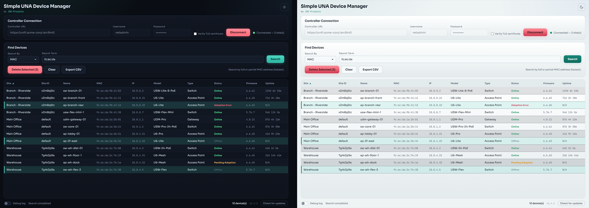

# Simple UNA Device Manager

Search devices across every site on a UniFi Network Application controller by
MAC, name, or IP, and remove orphaned or unmanageable devices that can't be
cleared from the UNA web UI. For network admins cleaning up stuck entries.

Built by [JDE-Projects](https://github.com/JDE-Projects).

If you enjoyed this project and would like to buy me a coffee, check out my [Ko-fi](https://ko-fi.com/jdeprojects).

## Preview

<p align="center">
  
  <br><em>Dark and light themes</em>
</p>

## Highlights
- Search all sites at once by MAC (fast two-pass), name, or IP.
- Sortable results: site, name, MAC, IP, model, type, status, firmware, uptime.
- Select one or more devices and delete them, with a confirmation step.
- CSV export of the current results.
- Checks the Releases page for a newer version (manual and a quiet check at startup).
- Optional debug log, off by default, with credentials redacted.
- Secrets are never saved (memory only, wiped on disconnect).

## How it works
- Backend: Python standard library (urllib) against the controller API.
- Window: pywebview on the Qt backend (PySide6), UI in `simple_una_device_manager-UI.html`.

## Download and run
Two ways to get it from the [Releases](../../releases) page - pick one:
- **Installer (recommended):** download `SimpleUNADeviceManager-vX.Y.Z-setup.exe` and
  run it. Installs the app, adds a Start menu shortcut, and can be removed later
  from Add or Remove Programs. Installs just for you by default (no admin); you can
  choose all users during setup.
- **Portable .zip:** download `SimpleUNADeviceManager-vX.Y.Z.zip`, extract it, and run
  `Simple UNA Device Manager.exe` from inside the extracted folder. No install - good for
  a locked-down PC or a USB stick. Keep the folder together.

Windows only, no Python or setup required. Unsigned, so SmartScreen may warn the
first time: More info > Run anyway.

## Updating

Simple UNA Device Manager doesn't update itself. The bottom bar has a **Check for updates** button that tells you when a newer release is out; when it does, get the new version from the [Releases](../../releases) page the same way you first installed it.

- **Installer:** download the new `SimpleUNADeviceManager-vX.Y.Z-setup.exe` and run it. It installs over your current copy and keeps your saved light/dark theme preference.
- **Portable .zip:** download and extract the new `SimpleUNADeviceManager-vX.Y.Z.zip`. To keep your light/dark theme choice, copy `simple_una_device_manager.pref` from the old folder into the new one.

Your controller login is never stored, so there's nothing else to carry over.

## Verify this download (optional)
This release was built on GitHub from this public source, not on a personal
machine, and is signed with a build-provenance attestation. To confirm your
download is genuine, install the [GitHub CLI](https://cli.github.com) and run:

```
gh attestation verify SimpleUNADeviceManager-vX.Y.Z.zip \
  --repo JDE-Projects/Simple-UNA-Device-Manager \
  --signer-repo JDE-Projects/Build-Tools
```

A `Verification succeeded!` line means the file was built by the published
pipeline from this repo. You can also check the file against the published
`.sha256`.

## Build from source (optional)
- Python 3 on PATH.
- `pip install -r requirements.txt` (pinned `pywebview`, `PySide6`, `qtpy`, `pyinstaller`; keep PyQt6 uninstalled).
- Keep `simple_una_device_manager.py`, `simple_una_device_manager-UI.html`, the
  `fonts/` folder, the `.ico`, `.png`, and `-splash.png` together.
- Run from source: `python simple_una_device_manager.py`
- Build the .exe: `Build_Simple_UNA_Device_Manager.bat` -> `dist\Simple UNA Device Manager\Simple UNA Device Manager.exe`

## Using it
1. Enter the controller URL, username, and password (a local admin account,
   not SSO), then Connect.
2. Choose what to search by (MAC, Hostname, or IP) and enter a full or partial
   term, then Search.
3. Click any column header to sort. Click rows to select one or more devices.
4. Delete Selected opens a confirmation listing the devices; confirm to remove
   them from their site.
5. Export CSV to save the current results.

## Security and privacy
- The password is never written to disk; it lives in memory only and is
  cleared on disconnect.
- The optional debug log is off by default. When on, it writes
  `Debug_Log_MMDDYYYY_HHMMSS.txt` next to the app with credentials redacted.
- Deleting a device is permanent and cannot be undone. Only delete devices that
  are orphaned or unmanageable from the UNA web UI. A device that is still
  connected to the network may reappear as pending adoption after deletion.

## A note on how this was built
This project was built with AI assistance. The design decisions, feature
direction, and real-world testing were directed by me. The code was written
and revised with an AI assistant against that direction. Treat it like any
community tool: review and test it before relying on it.

## License
Released under the PolyForm Noncommercial License 1.0.0 (see
[LICENSE](LICENSE)). Free for personal and any noncommercial use, modification,
and noncommercial redistribution; commercial use is not permitted. Keep the
copyright notice; no warranty. This tool bundles third-party code; see
[THIRD-PARTY-LICENSES.txt](THIRD-PARTY-LICENSES.txt).

For commercial licensing, open a [GitHub issue](https://github.com/JDE-Projects/Simple-UNA-Device-Manager/issues) with the title "Commercial License Inquiry".
